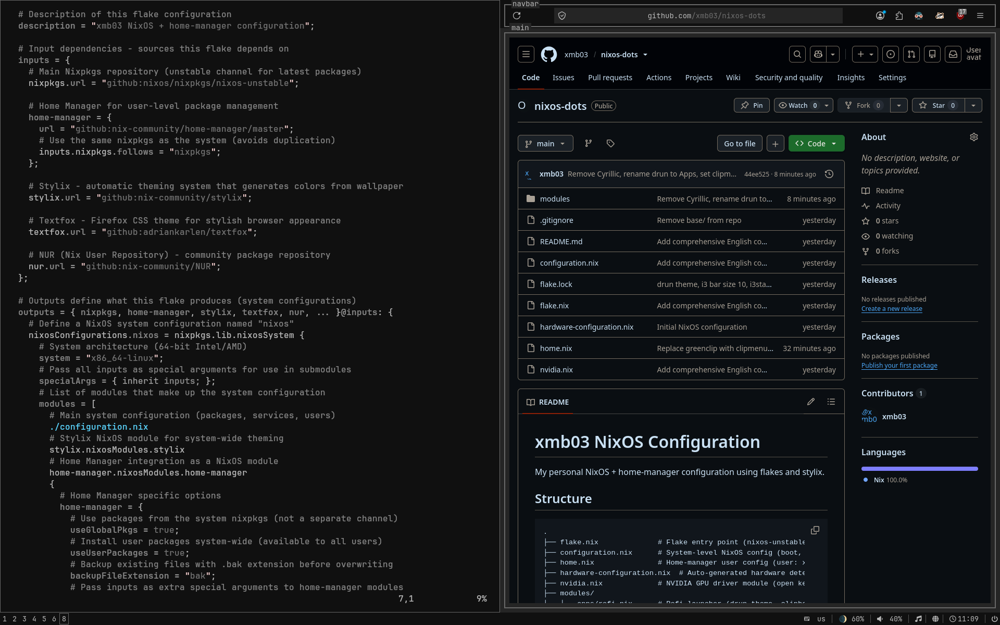
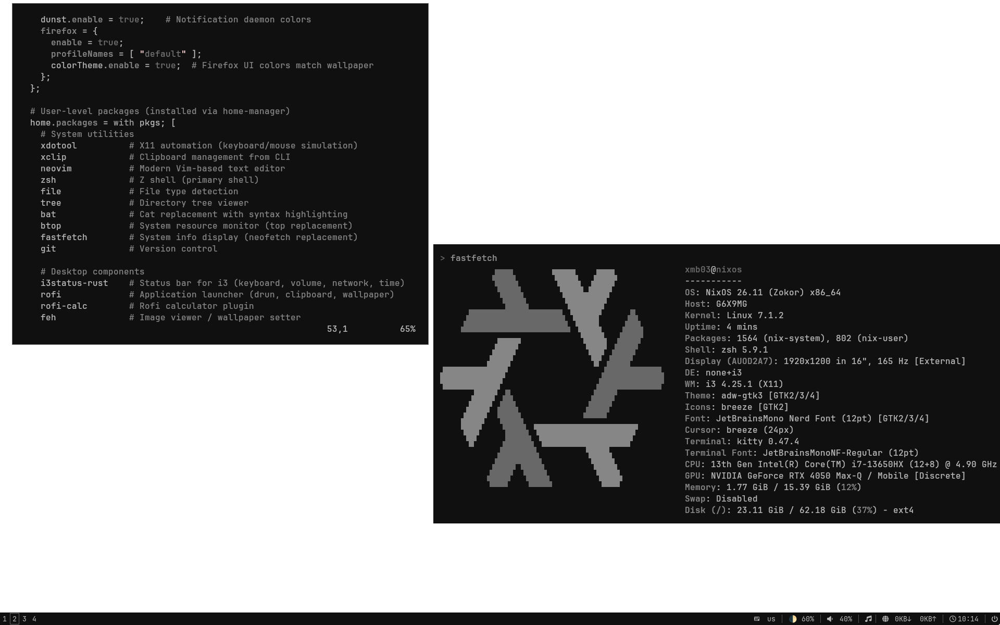

# xmb03 NixOS Configuration

Personal NixOS + home-manager configuration for GIGABYTE G6X9MG laptop (Intel i7-13650HX + NVIDIA RTX 4050).

- [🇷🇺 Полная документация](DOCS.md)
- [🇬🇧 Full documentation (English)](DOCS_EN.md)

## Screenshots




## Quick start

```bash
git clone https://github.com/xmb03/nixos-dots.git ~/.config/nixos
sudo nixos-generate-config --show-hardware-config > ~/.config/nixos/hardware-configuration.nix
# Edit configuration.nix — hostname, user, timezone
sudo nixos-rebuild switch --flake ~/.config/nixos#nixos
passwd
```

## Stack

| Component | Choice |
|---|---|
| Distribution | NixOS 26.11 (unstable) |
| Window manager | i3 |
| Compositor | Picom (GLX vsync, no effects) |
| Display manager | LightDM (auto-login) |
| Bar | i3status-rust |
| Launcher | Rofi |
| Terminal | Kitty |
| Shell | Zsh |
| Editor | Vim + Neovim |
| File manager | Yazi |
| Browser | Firefox (textfox theme) |
| Notifications | Dunst |
| Clipboard | clipmenu (rofi frontend) |
| Screenshots | maim (+ slop for region) |
| GPU drivers | NVIDIA open kernel modules, PRIME Offload |
| Theming | Stylix (grayscale-dark) |
| Audio | PipeWire |
| LLM | Ollama (CUDA) |

## Commands

```bash
sudo nixos-rebuild switch --flake ~/.config/nixos#nixos          # Full rebuild
sudo nix-collect-garbage -d && sudo nix-collect-garbage --delete-older-than 30d  # GC
nvidia-offload <command>                                         # Run on NVIDIA GPU
home-manager switch --flake ~/.config/nixos                      # User-level only
```
